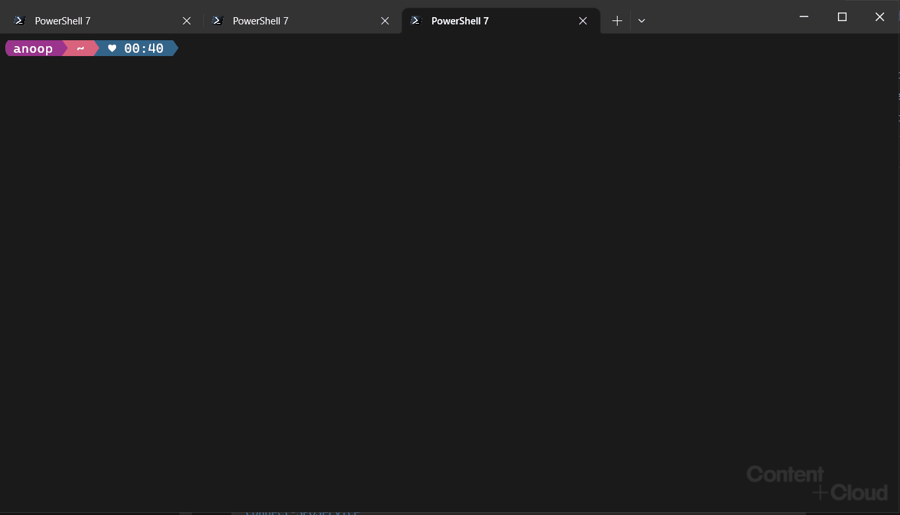

# SPO PowerShell Predictor module

## Overview

[SPO PowerShell Predictor](https://www.powershellgallery.com/packages/SPO.PowerShell.Predictor) is a PowerShell
module that helps you navigate the cmdlets and parameters of
[SharePoint Online Management Shell](https://learn.microsoft.com/en-us/powershell/sharepoint/sharepoint-online/connect-sharepoint-online) in PowerShell. It provides suggestions for command completion when using SharePoint Online Managment Shell cmdlets in PowerShell.

SPO PowerShell Predictor uses the
[subsystem plugin model](/powershell/scripting/learn/experimental-features#pssubsystempluginmodel)
available in PowerShell 7.2. This updated version requires
[PSReadLine 2.2.2](https://www.powershellgallery.com/packages/PSReadLine/2.2.2) or higher to display
suggestions.



## Requirements

Required configuration for SPO PowerShell Predictor:

- [PowerShell 7.2](https://github.com/PowerShell/PowerShell/) or higher
- [PSReadline 2.2.2](https://github.com/PowerShell/PSReadLine/) or higher

Install the latest version of PSReadLine:

```powershell
Install-Module -Name PSReadline
```

#### Set preferred source and view for suggestions

Enable predictions from history and plugins

```powershell
Set-PSReadLineOption -PredictionSource HistoryAndPlugin
```

Enable list view:

```powershell
Set-PSReadLineOption -PredictionViewStyle ListView
```

## Getting started

### Install SPO PowerShell Predictor

To install the SPO.PowerShell.Predictor PowerShell module run the following

```powershell
Install-Module -Name SPO.PowerShell.Predictor
```

### Import SPO PowerShell Predictor

To import the SPO PowerShell Predictor PowerShell module in the current session run the following

```powershell
Import-Module -Name SPO.PowerShell.Predictor
```

### Use SPO PowerShell Predictor

Once imported, start typing SharePoint Online Management Shell cmdlet (e.g. `Connect-SPOService`) and see the predictions loading.

## Changing predictions search method

By default the module uses `Contains` search i.e. it shows predictions that contain the input entered. This can be changed to either `StartsWith` or `Fuzzy` by using the following cmdlet

```powershell
Set-PnPPredictorSearch -Method StartsWith|Contains|Fuzzy
```

`StartsWith` - as per the name shows predictions that start with the entered input
`Fuzzy` - does a Fuzzy search and returns predictions. Sometimes the results might not be as per the expectaion in this case.
## Uninstallation

Once installed and enabled, SPO PowerShell Predictor is loaded in the PowerShell profile.
To uninstall the SPO.PowerShell.Predictor module:

1. Close **all** PowerShell sessions including VS Code.

1. Launch a PowerShell session with no profile.

   ```powershell
   pwsh -noprofile
   ```

1. Uninstall SPO PowerShell Predictor

   ```powershell
   Uninstall-Module -Name SPO.PowerShell.Predictor -Force
   ```

1. Close PowerShell